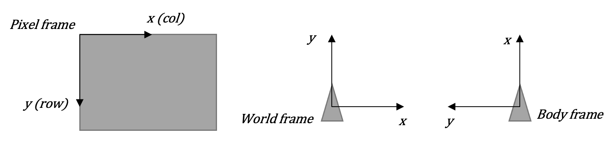
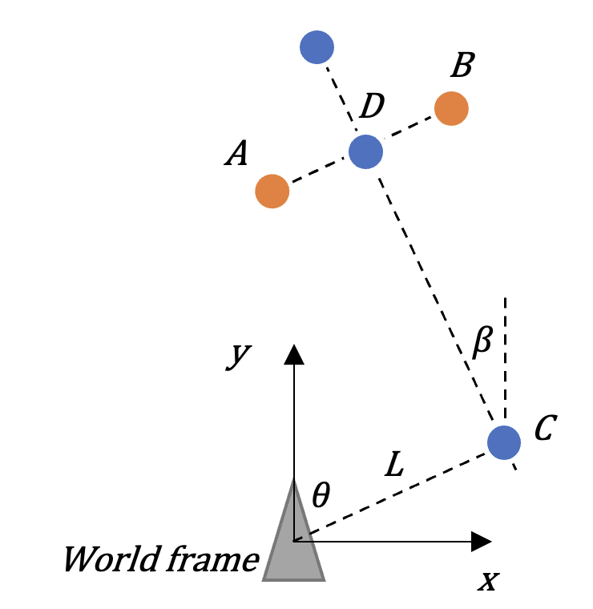
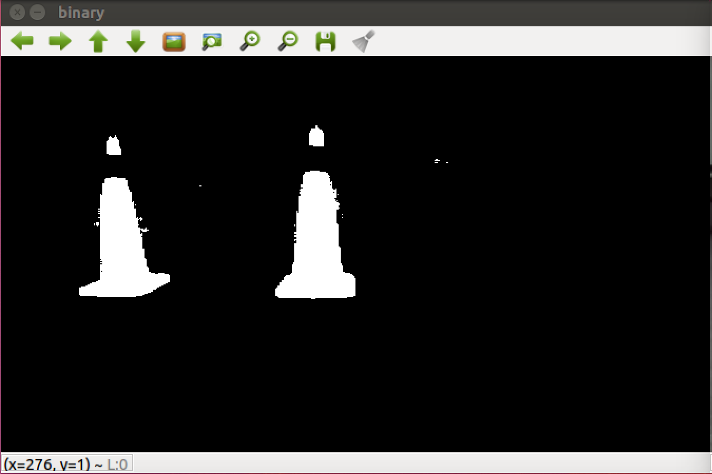
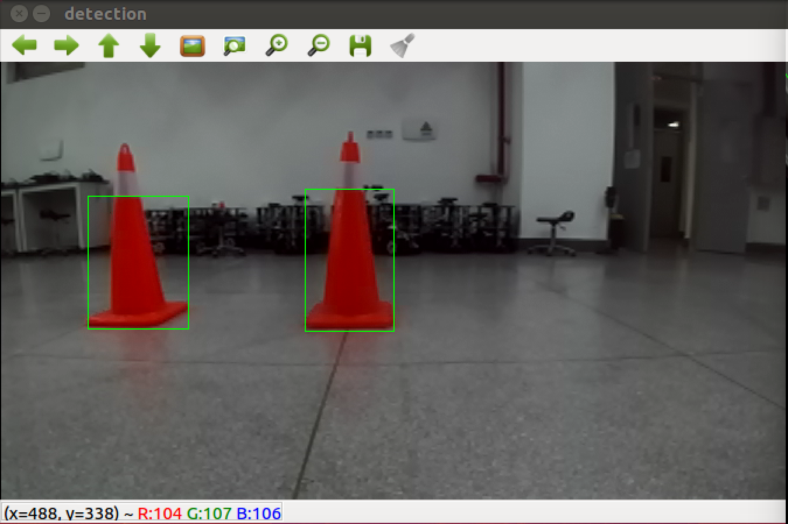
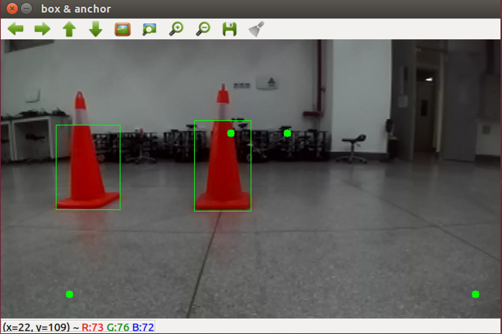
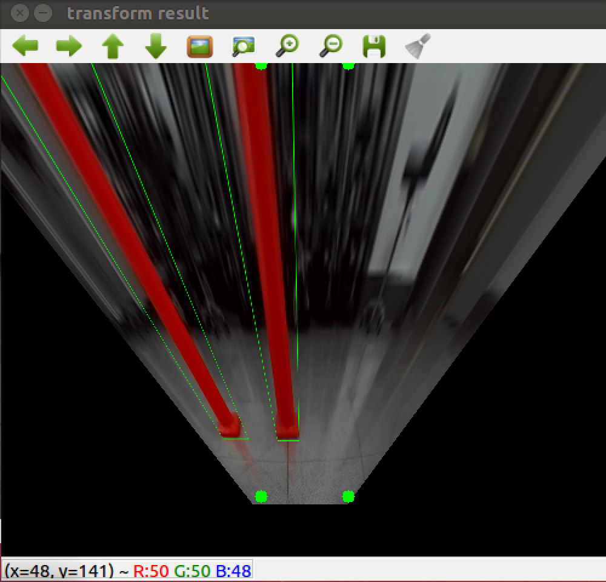

# HISTZ DIP Coursework Documentation

* Astern: achieve self-positioning by recognizing two colorful column and drive the robot through the middle
* School of Mechanical Engineering and Automation
* Thu Nov 11, 2021
* Yueqian Liu

## 研究目标

1. **使用单目RGB图像确定与特定颜色目标之间的大致相对位置**

2. **使用简单路径策略和反馈控制使Dashgo机器人穿过目标之间的空隙**

3. **实现plug-and-play的设置和部署**

## 研究内容

1. **用颜色识别获取目标的原始像素坐标**
   
   1. 将色彩空间从BGR转换到HSV
   2. 对HSV每一个值设定范围，筛选出特定颜色的区域
   3. 对联通域进行筛选，得到符合要求的联通域
   4. 作最小外接矩形并获取矩形底边中心点像素坐标$(x_s,y_s)$
   
2. **用透视变换获取场景俯视图**

   1. 在未变换图像上以地砖的格子为参考选取一个等腰梯形的顶点，同时指定变换后四个点期望的位置

   2. 用上述确定的两组点调用`cv::getPerspectiveTransform`获取变换矩阵$\bold{A}$，调用`cv::warpPerspective`可以获得变换后的图像

   3. 使用$\bold{A}$和之前识别获得的$(x_s,y_s)$计算矩形底边中心点变换后的像素坐标$(x_p,y_p)$
      $$
      x_p=\frac{\bold{A}_{11}x_s+\bold{A}_{21}y_s+\bold{A}_{31}}{\bold{A}_{13}x_s+\bold{A}_{23}y_s+\bold{A}_{33}}\\
      y_p=\frac{\bold{A}_{12}x_s+\bold{A}_{22}y_s+\bold{A}_{32}}{\bold{A}_{13}x_s+\bold{A}_{23}y_s+\bold{A}_{33}}
      $$

3. **作简单坐标变换获取目标和路径点的世界坐标**

   1. 坐标系描述如图

      

      * 世界坐标系用来建立大致相对位置关系
      * 机体坐标系为右手系，作为运动指令的参考

   2. 在场景俯视图中用鼠标大致选取一个坐标作为相机原点，这个坐标记为$(x_o,y_o)$

   3. 以地砖为参考，得到像素单位到距离单位米的缩放系数$K$

   4. 测量相机位置到Dashgo运动学中心的偏置$(x_d,y_d)$

   5. 设俯视图中某点的像素坐标为$(x_p,y_p)$，记其世界坐标为$(x_w,y_w)$，他们有如下关系
      $$
      \begin{align}
      x_w&=\frac{x_p-x_o}{K}+x_d\\
      y_w&=\frac{y_o-y_p}{K}+y_d
      \end{align}
      $$

4. **通过状态机实现运动策略**

   1. 运动策略为先作垂线段运行到两个雪糕筒中垂线的某点上，再由视觉反馈导航穿过雪糕筒中间

   2. 参数计算

      

      * 计算中某个中间变量为
        $$
        \alpha=\frac{1}{2}\frac{x_B^2+y_B^2-x_A^2-y_A^2}{(x_B-x_A)^2+(y_B-y_A)^2}
        $$

      * 于是各路径参数如下
        $$
        \begin{align}
        x_D&=\alpha(x_B-x_A)\\
        y_D&=\alpha(y_B-y_A)\\
        L&=\sqrt{x_D^2+y_D^2}\\
        \theta&=\atan(\frac{x_D}{y_D})\\
        \beta&=\atan(\frac{y_B-y_A}{x_B-x_A})
        \end{align}
        $$

   3. 运动状态机

      1. 根据$\theta$转向C点
      2. 依靠里程计直走$L$距离到达C点
      3. 根据$\beta$转向朝向D点
      4. 视觉比例控制达到D点再开环运行一段时间后停止


## 方案设计

1. **plug-and-play工程**

   1. https://gitee.com/yueqianliu/dash-to-cones
   2. <u>*在一般环境配置OK的情况下*</u>，clone下来直接运行`lazy_button.sh`即可，详见仓库的`readme.md`
   
2. **用颜色识别获取目标的原始像素坐标**

   1. 函数实现

      ```c++
      void HSV_threshold(Mat H, Mat S, Mat V, Mat dst, int H_L, int H_H, int S_L, int S_H, int V_L, int V_H)
      {
          int row = H.rows;
          int col = H.cols;
          int final_approach_flag = 0;
          for (int i = 0; i < row; i++)
          {
              for (int j = 0; j < col; j++)
              {
                  int ele_H = H.at<uchar>(i, j);
                  int ele_S = S.at<uchar>(i, j);
                  int ele_V = V.at<uchar>(i, j);
                  if ((ele_H > H_H || ele_H < H_L) || (ele_S > S_H || ele_S < S_L) || (ele_V > V_H || ele_V < V_L))
                  {
                      dst.at<uchar>(i, j) = 1;
                  }
                  else
                  {
                      dst.at<uchar>(i, j) = 255;
                  }
                  if (dst.at<uchar>(i, j) != 255)
                  {
                      dst.at<uchar>(i, j) = 0;
                  }
              }
          }
          imshow("binary", dst);
      }
      
      void color_detect(Mat input, Center *center_left, Center *center_right, int *Pixel_left, int *Pixel_right, int H_L, int H_H, int S_L, int S_H, int V_L, int V_H)
      {
          Mat input_HSV;
          cvtColor(input, input_HSV, COLOR_RGB2HSV);
          Mat HSV[3];
          split(input_HSV, HSV);
          Mat H = HSV[0].clone();
          Mat S = HSV[1].clone();
          Mat V = HSV[2].clone();
          Mat res = HSV[0].clone();
      
          HSV_threshold(HSV[0], HSV[1], HSV[2], res, H_L, H_H, S_L, S_H, V_L, V_H);
      
          Mat S_temp = S.clone();
          Mat res_temp = res.clone();
          Mat res_canny;
          Canny(res, res_canny, 50, 150);
      
          vector< vector<Point> > contours_S;
          vector<Vec4i> hierarchy_S;
          if (current_step <= 30)
          {
              findContours(H, contours_S, hierarchy_S, CV_RETR_TREE, CHAIN_APPROX_SIMPLE, Point());
          }
          else
          {
              findContours(res, contours_S, hierarchy_S, CV_RETR_TREE, CHAIN_APPROX_SIMPLE, Point());
          }
      
          Mat S_Contours = Mat::zeros(S.size(), CV_8UC1);
          Mat Contours = Mat::zeros(S.size(), CV_8UC1);
          for (int i = 0; i < contours_S.size(); i++)
          {
              for (int j = 0; j < contours_S[i].size(); j++)
              {
                  Point P = Point(contours_S[i][j].x, contours_S[i][j].y);
                  Contours.at<uchar>(P) = 255;
              }
              drawContours(S_Contours, contours_S, i, Scalar(255), 1, 8, hierarchy_S);
          }
          current_step += 1;
      
          vector< vector<Point> > contours_poly(contours_S.size());
          vector<Rect> boundRect(contours_S.size());
          vector<Point2f> center(contours_S.size());
          vector<float> radius(contours_S.size());
      
          for (int i = 0; i < contours_S.size(); i++)
          {
              boundRect[i] = boundingRect(Mat(contours_S[i]));
          }
      
          for (int i = 0; i < contours_S.size(); i++)
          {
              rectangle(S_Contours, boundRect[i].tl(), boundRect[i].br(), Scalar(255), 1, 8, 0);
          }
      
          int index_second = 0;
          int index_max = 0;
          double Area_max = 0;
          double Area_second = 0;
          for (int i = 0; i < contours_S.size(); i++)
          {
              if (boundRect[i].area() > Area_max)
              {
                  index_second = index_max;
                  Area_second = Area_max;
                  index_max = i;
                  Area_max = boundRect[i].area();
              }
              else if (boundRect[i].area() > Area_second)
              {
                  index_second = i;
                  Area_second = boundRect[i].area();
              }
          }
          rectangle(input, boundRect[index_second].tl(), boundRect[index_second].br(), Scalar(0, 255, 0));
          rectangle(input, boundRect[index_max].tl(), boundRect[index_max].br(), Scalar(0, 255, 0));
      
          if (boundRect[index_second].tl().x < boundRect[index_max].tl().x)
          {
              center_left->x = (boundRect[index_second].tl().x + boundRect[index_second].br().x) / 2;
              center_left->y = (boundRect[index_second].tl().y + boundRect[index_second].br().y) / 2;
              center_right->x = (boundRect[index_max].tl().x + boundRect[index_max].br().x) / 2;
              center_right->y = (boundRect[index_max].tl().y + boundRect[index_max].br().y) / 2;
              *Pixel_left = boundRect[index_second].area();
              *Pixel_right = boundRect[index_max].area();
              x_a_temp = center_left->x;
              y_a_temp = boundRect[index_second].br().y;
              x_b_temp = center_right->x;
              y_b_temp = boundRect[index_max].br().y;
          }
          else
          {
              center_right->x = (boundRect[index_second].tl().x + boundRect[index_second].br().x) / 2;
              center_right->y = (boundRect[index_second].tl().y + boundRect[index_second].br().y) / 2;
              center_left->x = (boundRect[index_max].tl().x + boundRect[index_max].br().x) / 2;
              center_left->y = (boundRect[index_max].tl().y + boundRect[index_max].br().y) / 2;
              *Pixel_right = boundRect[index_second].area();
              *Pixel_left = boundRect[index_max].area();
              x_a_temp = center_left->x;
              y_a_temp = boundRect[index_max].br().y;
              x_b_temp = center_right->x;
              y_b_temp = boundRect[index_second].br().y;
          }
      
          imshow("detection", input);
          waitKey(1);
      }
      ```

   2. 调用

      ```c++
      int H_L = 117; // HSV thresh for bright orange cones
      int H_H = 126;
      int S_L = 148;
      int S_H = 255;
      int V_L = 28;
      int V_H = 255;
      color_detect(src_mono, &center_left, &center_right, &Pixel_left, &Pixel_right, H_L, H_H, S_L, S_H, V_L, V_H);
      ```

      > 函数输入为单目彩色图像
      >
      > 输出为左右两个目标区域的中心点坐标和像素个数
      >
      > 雪糕筒（目标）为亮橙色

3. **用透视变换获取场景俯视图**

   1. 函数实现

      ```c++
      bool perspective_transform(Mat &img, Mat &dst, Point2d P1, Point2d P2, Point2d P3, Point2d P4)
      {
          if (img.data)
          {
              Point2f corners[4];       // 4 pts in src img
              Point2f corners_trans[4]; // 4 pts in inverse perspective map
      
              // params of the tranform
              float roi_x0 = 0;
              float roi_y0 = 228;
              float ROI_HEIGHT = 30000;
              float ROI_WIDTH = 6000;
      
              corners[0] = P2;
              corners[1] = P3;
              corners[2] = P1;
              corners[3] = P4;
      
              // set width of the inverse perpective img
              float IPM_WIDTH = 500;
              float N = 7;
      
              // assure that the IPM width is about N times the width of robot head width
              float scale = (IPM_WIDTH / N) / ROI_WIDTH;
              float IPM_HEIGHT = ROI_HEIGHT * scale;
      
              // init transform
              dst = Mat::zeros(IPM_HEIGHT + 50, IPM_WIDTH, img.type());
      
              corners_trans[0] = Point2f(IPM_WIDTH / 2 - IPM_WIDTH / (2 * N), 0);          //P2
              corners_trans[1] = Point2f(IPM_WIDTH / 2 + IPM_WIDTH / (2 * N), 0);          //P3
              corners_trans[2] = Point2f(IPM_WIDTH / 2 - IPM_WIDTH / (2 * N), IPM_HEIGHT); //P1
              corners_trans[3] = Point2f(IPM_WIDTH / 2 + IPM_WIDTH / (2 * N), IPM_HEIGHT); //P4
      
              // calculate transform matrix
              Mat warpMatrix_src2ipm = getPerspectiveTransform(corners, corners_trans);
              warpPerspective(img, dst, warpMatrix_src2ipm, dst.size());
              double a11 = warpMatrix_src2ipm.at<double>(0, 0);
              double a12 = warpMatrix_src2ipm.at<double>(1, 0);
              double a13 = warpMatrix_src2ipm.at<double>(2, 0);
              double a21 = warpMatrix_src2ipm.at<double>(0, 1);
              double a22 = warpMatrix_src2ipm.at<double>(1, 1);
              double a23 = warpMatrix_src2ipm.at<double>(2, 1);
              double a31 = warpMatrix_src2ipm.at<double>(0, 2);
              double a32 = warpMatrix_src2ipm.at<double>(1, 2);
              double a33 = warpMatrix_src2ipm.at<double>(2, 2);
              x_a = (a11 * x_a_temp + a21 * y_a_temp + a31) / (a13 * x_a_temp + a23 * y_a_temp + a33);
              y_a = (a12 * x_a_temp + a22 * y_a_temp + a32) / (a13 * x_a_temp + a23 * y_a_temp + a33);
              x_b = (a11 * x_b_temp + a21 * y_b_temp + a31) / (a13 * x_b_temp + a23 * y_b_temp + a33);
              y_b = (a12 * x_b_temp + a22 * y_b_temp + a32) / (a13 * x_b_temp + a23 * y_b_temp + a33);
      
              // mark the pts on img
              for (int i = 0; i < 4; i++)
                  circle(img, corners[i], 5, Scalar(0, 255, 0), -1);
              for (int i = 0; i < 4; i++)
                  circle(dst, corners_trans[i], 5, Scalar(0, 255, 0), -1);
      
              imshow("box & anchor", img);
              imshow("transform result", dst);
          }
          else
          {
              ROS_WARN("NO IMAGE");
              return false;
          }
      
          return true;
      }
      ```

   2. 调用

      ```c++
      Mat out;
      Point2d point1(92, 343);
      Point2d point2(309, 126);
      Point2d point3(385, 126);
      Point2d point4(638, 343);
      perspective_transform(src_mono, out, point1, point2, point3, point4);
      ```

      > 输入四个点为变换参考点
      >
      > 与具体相机参数和安装位姿有关
      >
      > 具体选取方法为在未变换的图像上以地砖格子为参考选取一个等腰梯形的顶点
      >
      > 期望变换后图像中的参考点变成一个矩形的顶点

4. **作简单坐标变换获取目标和路径点的世界坐标**

   1. 函数实现

      ```c++
      void get_target_coords(int xa, int ya, int xb, int yb)
      {
        	double K = 90; // params for get_target_coords()
          double xo = 247;
          double yo = 363;
      
          x_A = (xa - xo) / K;
          y_A = (yo - ya) / K + 0.35;
      
          x_B = (xb - xo) / K;
          y_B = (yo - yb) / K + 0.35;
      
          x_D = (x_A + x_B) / 2.0;
          y_D = (y_A + y_B) / 2.0;
      }
      ```

      > `K`为缩放系数，将像素单位转换为米
      >
      > `(xo, yo)`为变换后图像（俯视图）的相机位置坐标，也就是中间最底下
      >
      > 相机位置到Dashgo运动学中心的距离为0.35米
      >
      > A和B为两个雪糕筒的矩形中心点
      >
      > D为两个雪糕筒连线中点

   2. 调用：在调用`perspective_transform`之后`get_target_coords`则可以获得目标点的世界坐标

5. **通过状态机实现运动策略**

   1. 函数实现

      ```c++
      void calculate_motion_param(void)
      {
          double alpha;
          alpha = (y_B * y_B - y_A * y_A + x_B * x_B - x_A * x_A) / (2 * ((y_B - y_A) * (y_B - y_A) + (x_B - x_A) * (x_B - x_A)));
          x_C = alpha * (x_B - x_A);
          y_C = alpha * (y_B - y_A);
          L = sqrt(x_C * x_C + y_C * y_C);
          theta = atan(x_C / y_C);
          beta = atan((y_A - y_B) / (x_B - x_A));
      }
      ```

   2. 状态机实现

      ```c++
      // ------------------------------------------ motion ------------------------------------------
      if (current_step >= 36)
      {
      
          // get distance and orientation relative to cones
          double center_x = (center_left.x + center_right.x) / 2.0;
          double center_y = (center_left.y + center_right.y) / 2.0;
          get_target_coords(x_a, y_a, x_b, y_b);
      
          ROS_INFO("*** MOTION ***");
      
          ROS_INFO("x_A = %f", x_A);
          ROS_INFO("y_A = %f", y_A);
          ROS_INFO("x_B = %f", x_B);
          ROS_INFO("y_B = %f", y_B);
      
          ROS_INFO("x_a = %f", x_a);
          ROS_INFO("y_a = %f", y_a);
          ROS_INFO("x_b = %f", x_b);
          ROS_INFO("y_b = %f", y_b);
      
          calculate_motion_param();
          ROS_INFO("L\t= %f", L);
          ROS_INFO("theta\t= %f", theta);
          ROS_INFO("beta\t= %f", beta);
      
          // turn towards mid-extension point
          if (state_machine == 0)
          {
      
              if (abs(angle + theta) > 0.05) // dead zone of angle deviation
              {
                  // turn right
                  if (theta > 0)
                  {
                      run(0, -abs(angle + theta));
                      pub.publish(msg);
                  }
                  // turn left
                  if (theta < 0)
                  {
                      run(0, abs(angle + theta));
                      pub.publish(msg);
                  }
              }
              else
              {
                  state_machine = 1;
                  sleep(1);
              }
      
              ROS_INFO("--- state machine 1: turn towards mid-extension point ---")
      
          }
          
          // go straight line to mid-extension point
          if (state_machine == 1)
          {
              if (sqrt(pos_x * pos_x + pos_y * pos_y) <= L + 0.25)
              {
                  run(0.3, 0);
                  pub.publish(msg);
              }
              else
              {
                  state_machine = 2;
                  sleep(1);
              }
              ROS_INFO("--- state machine 1: go straight line to mid-extension point ---");
              ROS_INFO("pos_x = %f", pos_x);
              ROS_INFO("pos_y = %f", pos_y);
          }
      
          // turn towards mid point between the cones
          if (state_machine == 2)
          {
              ROS_INFO("--- state machine 2: turn towards mid point between the cones ---");
              ROS_INFO("angle\t= %f", angle);
              ROS_INFO("beta\t= %f", beta);
              ROS_INFO("sum\t= %f", angle + beta);
      
              if (abs(angle + beta) > 0.1)
              {
                  if (theta > 0)
                  {
                      run(0, abs(angle + beta));
                      pub.publish(msg);
                  }
                  else
                  {
                      run(0, -abs(angle + beta));
                      pub.publish(msg);
                  }
              }
              else
              {
                  state_machine = 3;
                  sleep(1);
              }
          }
          
          // go through the cones with visual feedback
          if (state_machine == 3)
          {
              ROS_INFO("--- state machine 3: go through the cones with visual feedback ---");
              ROS_INFO("distance\t= %f", sqrt(pow(pos_y + x_D, 2) + pow(pos_x - y_D, 2)));
              ROS_INFO("pos_x\t= %f", pos_x);
              ROS_INFO("pos_y\t= %f", pos_y);
              ROS_INFO("x_D\t= %f", x_D);
              ROS_INFO("y_D\t= %f", y_D);
      
              if(final_approach_flag != 1)
              {
                  delta_x = X0 - center_x; // X0=336=center of the pixel frame, center_x is updated from color_detect()
                  run(0.2, 0.01 * delta_x); // angular velocity feedback
              }
              else // in final approach mode, go blind without feedback for 2.2m then stop
              {
                  if (sqrt(pow(pos_x - pos_x_temp, 2) + pow(pos_y - pos_y_temp, 2)) > 2.2)
                  {
                      break;
                  }
                  run(0.2, 0);
              }
      
              // if is close enough to the mid point D, enter final approach mode, the point of transition is marked as temp
              if (sqrt(pow(pos_y + x_D, 2) + pow(pos_x - y_D, 2)) < 0.5 && final_approach_flag == 0)
              {
                  pos_x_temp = pos_x;
                  pos_y_temp = pos_y;
                  final_approach_flag = 1;
              }
      
              pub.publish(msg);
          }
      }
      ```

## 实验验证

1. **视频在这：https://gitee.com/yueqianliu/dash-to-cones/blob/master/doc/demo.mov**

2. **目标检测**

    

3. **透视变换**

    

## 结论

1. **通过下列方法实现了在非正对起始的条件下穿越雪糕筒中间空隙的功能**

   1. 基于颜色的目标识别
   2. 透视变换
   3. 简单的运动策略

2. **优点**

   1. 代码简单粗暴
   2. 思路清晰
   3. 可以在非正对起始的条件下穿越雪糕筒中间较小的空隙

3. **不足和改进**

   1. 未作镜头畸变的矫正

      > 畸变矫正之后再透视变换可以减少最终阶段控制器的压力

   2. 运动策略不够优雅流畅

      > 可以使用类似规划-追踪控制的方案比如EGO+MPC效果应该会很不错

   3. 没有考虑视野中目标缺失的起始情况

      > 一开始可以转动一圈

   4. 颜色识别可能会被同颜色物体和环境光干扰

      > 使用基于网络的方法进行识别

## 参考文献

1. https://en.wikipedia.org/wiki/3D_projection#Perspective_projection
2. https://www.bilibili.com/video/BV1Z7411y7iJ

